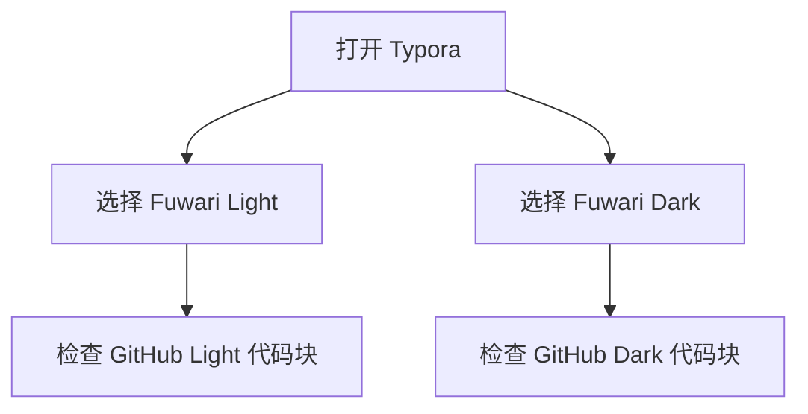
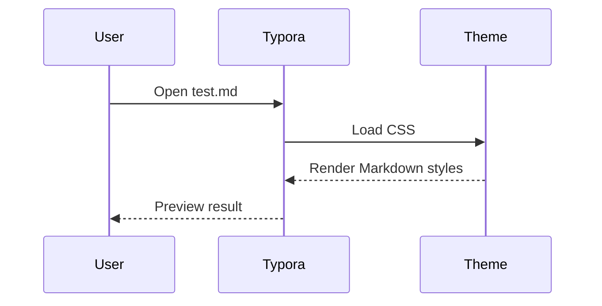

# Fuwari Typora Theme Test

这份文档用于检查 Fuwari Typora 主题对常见 Markdown / Typora 语法的渲染效果，包括正文、标题、列表、引用、表格、代码块、数学公式、脚注、图片、HTML、图表等。


---

## 1. 标题层级

# H1 一级标题

## H2 二级标题

### H3 三级标题

#### H4 四级标题

##### H5 五级标题

###### H6 六级标题

---

## 2. 段落与行内样式

普通段落：Fuwari 是一个柔和、圆润、带有轻微玻璃感和卡片感的博客主题。这里放一段较长的中文文本，用于检查行高、字距、段落间距和中英文混排效果。The quick brown fox jumps over the lazy dog. 0123456789.

强调与装饰：**粗体**、*斜体*、***粗斜体***、~~删除线~~、==高亮文本==、`inline code`、`行内代码 with 中文`。

上标和下标：H~2~O，E = mc^2^。

转义字符：\*不是斜体\*，\`不是代码\`，\[不是链接\]。

键盘按键：<kbd>Command</kbd> + <kbd>K</kbd>，<kbd>Ctrl</kbd> + <kbd>Shift</kbd> + <kbd>P</kbd>。

---

## 3. 链接

行内链接：[Fuwari GitHub](https://github.com/saicaca/fuwari)。

自动链接：<https://typora.io/>。

邮箱链接：<hello@example.com>。

引用式链接：[Typora custom theme docs][typora-theme-doc]。

[typora-theme-doc]: https://theme.typora.io/doc/Write-Custom-Theme/

---

## 4. 列表

### 无序列表

- 第一项
- 第二项
  - 嵌套 A
  - 嵌套 B
    - 更深一层
- 第三项，包含较长文本，用于检查列表项换行后的缩进是否正确，以及项目符号和正文之间的间距是否自然。

### 有序列表

1. 打开 Typora。
2. 打开主题目录。
3. 复制主题文件。
   1. `fuwari-light.css`
   2. `fuwari-dark.css`
   3. `fuwari-assets/`
4. 重启 Typora 并选择主题。

### 任务列表

- [x] 创建 light 主题
- [x] 创建 dark 主题
- [x] 调整代码块
- [ ] 在 Typora 中人工检查所有语法
- [ ] 根据截图继续微调

---

## 5. 引用与提示块

> 这是普通引用。它应该有清晰的边界、舒服的背景色和足够的内边距。
>
> 引用内部的第二段文本，用于检查多段引用的间距。

> [!NOTE]
> 这是 GitHub 风格的 Note 提示块。
>
> 这是 Note 提示块的第二行

> [!TIP]
> 这是 Tip 提示块。可以用来展示建议。

> [!IMPORTANT]
> 这是 Important 提示块。

> [!WARNING]
> 这是 Warning 提示块。

> [!CAUTION]
> 这是 Caution 提示块。

---

## 6. 表格

| 语法 | 状态 | 说明 |
| --- | :---: | ---: |
| 标题 | 已支持 | 左对齐 |
| 表格 | 已支持 | 右对齐数字 `123.45` |
| 代码块 | 已支持 | `GitHub Light / Dark` |
| 数学公式 | 取决于 Typora 设置 | $a^2 + b^2 = c^2$ |

复杂表格内容：

| Feature | Example | Notes |
| --- | --- | --- |
| Inline style | **bold**, *italic*, `code` | 检查表格内行内样式 |
| Link | [GitHub](https://github.com/) | 检查链接颜色 |
| CJK | 中文、かな、한글 | 检查多语言文字 |

---

## 7. 代码

### 行内代码

请检查 `npm install`、`const value = 42`、`中文变量 = "测试"` 的行内代码样式。

### Plain text

```text
Plain text code block.
Line 2 with symbols: !@#$%^&*()_+-=[]{}|;':",./<>?
中文行：用于检查代码字体中的中文显示。
```

### Shell

```bash
# 全局安装，所有项目可用
npx skills add Caph-dev/agents-progressive-disclosure -g

# 只安装到 Cursor
npx skills add Caph-dev/agents-progressive-disclosure -a cursor -y
```

### JavaScript

```js
const theme = {
  name: "fuwari-typora",
  mode: "light",
  code: {
    background: "#f6f8fa",
    fontFamily: "Maple Mono Normal NF CN",
  },
};

function renderToken(token) {
  if (!token) return null;
  return `${token.type}: ${token.value}`;
}

console.log(renderToken({ type: "keyword", value: "const" }));
```

### TypeScript

```ts
type ThemeMode = "light" | "dark";

interface CodeTheme {
  mode: ThemeMode;
  background: string;
  tokens: Record<string, string>;
}

const githubLight: CodeTheme = {
  mode: "light",
  background: "#f6f8fa",
  tokens: {
    keyword: "#cf222e",
    string: "#0a3069",
  },
};
```

### Python

```python
from dataclasses import dataclass


@dataclass
class Theme:
    name: str
    dark: bool = False


def describe(theme: Theme) -> str:
    mode = "dark" if theme.dark else "light"
    return f"{theme.name}: {mode}"


print(describe(Theme("Fuwari Light")))
```

### HTML

```html
<article class="card" data-theme="fuwari">
  <h1>Fuwari Typora</h1>
  <p>柔和的 Markdown 阅读体验。</p>
  <a href="https://github.com/saicaca/fuwari">Source</a>
</article>
```

### CSS

```css
:root {
  --fuwari-code-bg: #f6f8fa;
  --fuwari-code-text: #24292f;
}

.markdown-body code {
  padding: 0.12rem 0.35rem;
  border-radius: 0.38rem;
  font-family: "Maple Mono Normal NF CN", ui-monospace, monospace;
}
```

### JSON

```json
{
  "name": "fuwari-typora",
  "themes": ["fuwari-light", "fuwari-dark"],
  "codeBlock": {
    "light": "github-light",
    "dark": "github-dark"
  }
}
```

### YAML

```yaml
theme:
  name: fuwari-typora
  modes:
    - light
    - dark
  code_font: Maple Mono Normal NF CN
```

### Rust

```rust
#[derive(Debug)]
struct Theme<'a> {
    name: &'a str,
    dark: bool,
}

fn main() {
    let theme = Theme { name: "Fuwari", dark: false };
    println!("{:?}", theme);
}
```

### Go

```go
package main

import "fmt"

type Theme struct {
    Name string
    Dark bool
}

func main() {
    fmt.Println(Theme{Name: "Fuwari", Dark: false})
}
```

### Java

```java
public class ThemeDemo {
    public static void main(String[] args) {
        String theme = "Fuwari Typora";
        System.out.println(theme);
    }
}
```

### SQL

```sql
SELECT name, mode, updated_at
FROM themes
WHERE name LIKE 'fuwari%'
ORDER BY updated_at DESC;
```

### Diff

```diff
- --fuwari-code-bg: #080d15;
+ --fuwari-code-bg: #f6f8fa;
  --fuwari-code-text: #24292f;
```

---

## 8. 数学公式

行内公式：$E = mc^2$，$a^2 + b^2 = c^2$。

块级公式：

$$
\int_{-\infty}^{\infty} e^{-x^2} dx = \sqrt{\pi}
$$

矩阵：

$$
\begin{bmatrix}
1 & 2 & 3 \\
4 & 5 & 6 \\
7 & 8 & 9
\end{bmatrix}
$$

---

## 9. 脚注

这是一个带脚注的句子。[^theme]

这是另一个脚注引用。[^typora]

[^theme]: Fuwari Typora Theme 的测试脚注。
[^typora]: Typora 支持脚注、数学公式、图表等扩展 Markdown 语法。

---

## 10. 图片

普通图片：


带标题的图片：


---

## 11. HTML 块

<details>
  <summary>点击展开 HTML details</summary>
  <p>这里是 HTML details 内部内容。它可以包含 <strong>加粗文本</strong>，也可以包含 <code>HTML code</code>。</p>
</details>

<div class="custom-html-block">
  <p>这是一个自定义 HTML 块，用于检查 HTML 块的边距和颜色继承。</p>
</div>

---

## 12. Mermaid 图表



---

## 13. 序列图



---

## 15. 混合压力测试

> 引用中包含列表：
>
> - **粗体列表项**
> - `inline code`
> - [链接](https://example.com)

1. 有序列表中包含代码块：

   ```js
   const nested = true;
   console.log({ nested });
   ```

2. 有序列表中包含引用：

   > Nested quote inside ordered list.

3. 有序列表中包含表格：

   | Key | Value |
   | --- | --- |
   | theme | fuwari |
   | editor | typora |

---

## 16. 长文本段落

这是一段用于测试长文排版的内容。Markdown 编辑器的主题不只要在短文本中好看，也要在长篇阅读中保持稳定的节奏。段落宽度、行高、字体颜色、链接颜色、引用块、代码块和表格都需要在同一个视觉系统中协调。A good theme should make writing feel calm, readable, and focused while still preserving enough visual hierarchy for scanning.

第二段长文本用于检查段落之间的距离。Fuwari 的视觉风格偏柔和，适合博客文章、技术笔记和说明文档。这里混合中文、English words、数字 1234567890、标点符号，以及 `inline code`，用于检查中英文混排和行内元素的稳定性。

---

## 17. 结束检查清单

- [x] 页面背景正常
- [ ] 文章卡片正常
- [ ] 标题层级正常
- [ ] 链接样式正常
- [ ] 表格边框正常
- [ ] 行内代码正常
- [ ] light 主题代码块为 GitHub Light
- [ ] dark 主题代码块为 GitHub Dark
- [ ] 代码块行号和竖线正常
- [ ] 数学公式正常
- [ ] Mermaid 图表正常
- [ ] 脚注正常
